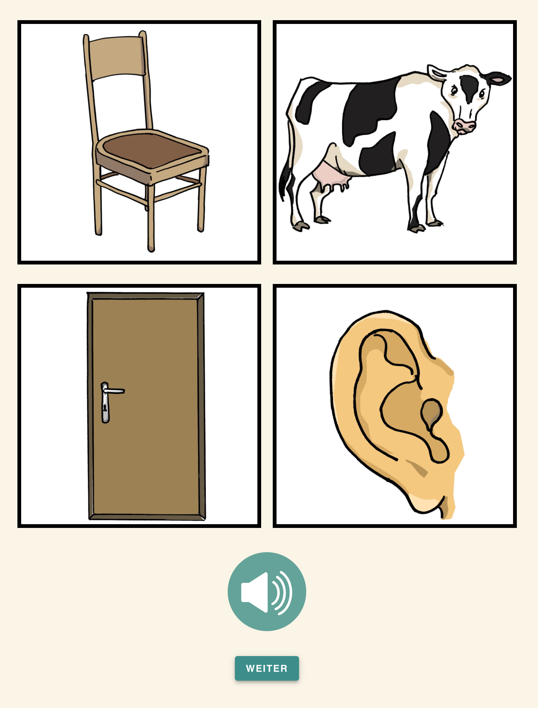
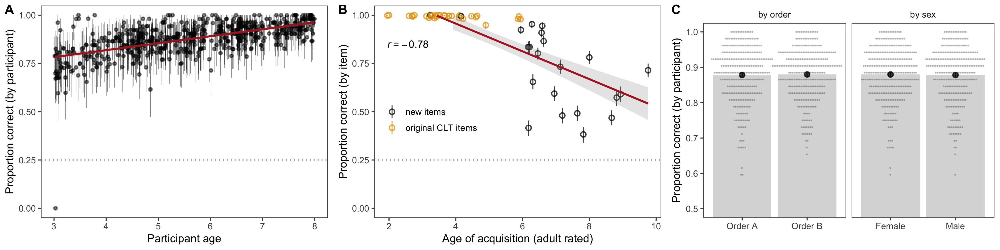
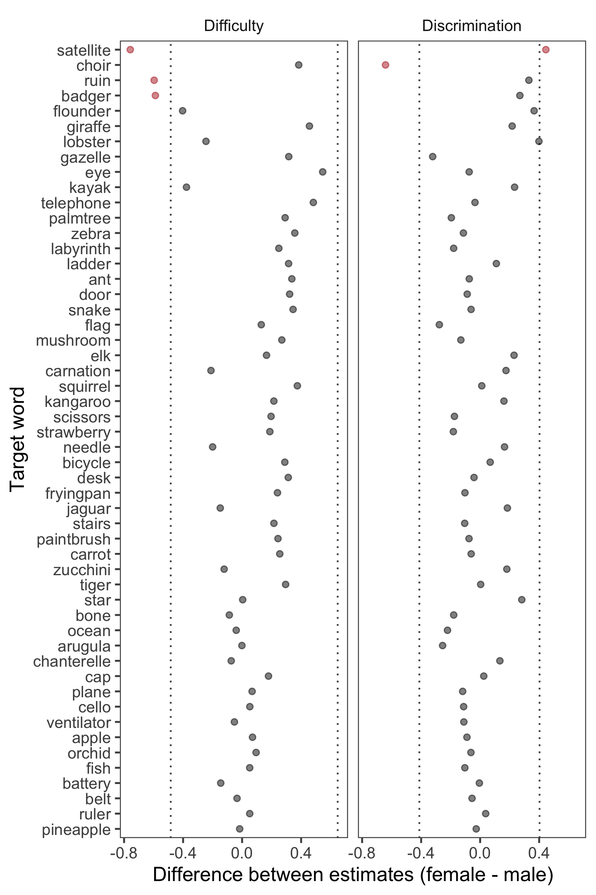
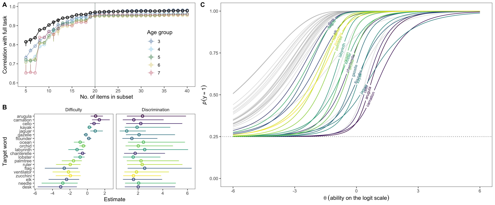

```{r setup, include = FALSE}
library("papaja")
library(tidyverse)
```

```{r analysis-preferences}
# Seed for random number generation
set.seed(42)
knitr::opts_chunk$set(cache.extra = knitr::rand_seed)
```

# Introduction

Individual differences in language abilities are early emerging, stable across development, and predictive of a wide range of psychological outcome variables including cognitive abilities, academic achievement, and mental health [@bornstein2018stability; @schoon2010children; @morgan201524; @marchman2008speed; @walker1994prediction]. From a methodological perspective, high-quality, easy-access measures of language abilities are therefore central to both basic and applied research on individual differences in language abilities. Ideally, such measures should also be comparable across languages in order to study which developmental processes are language-specific and which are shared more widely. Developing such measures is very time and resource intensive and, as a consequence, few exist. In this paper, we describe the construction of a new receptive vocabulary task for German-speaking children. Its psychometric grounding in Item Response Theory makes the measure robust and efficient. Its web-based design and implementation makes the measure easy to adapt and administer in different settings (in-person or remote) and thereby facilitates the scaling of data collection.

Language has many facets and aspects that can be focused on when assessing individual differences between children. One particular productive approach has been the study of children’s vocabulary skills, that is, their knowledge of word-object mappings. This skill can be most effectively assessed, for example by asking children to name an object (production) or pick out an object that matches a word they just heard (comprehension). Children with larger vocabularies are taken to have advanced language skills more broadly. This assumption seems to be justified in light of strong correlations between vocabulary size and other language measures such as grammatical [e.g., @moyle2007longitudinal; @hoff2018explains] or narrative skills [@bohnacker2021storytelling; @fiani2021macrostructure; @lindgren2022age; @tsimpli2016narrative]. Vocabulary skills have also been used as an indicator of developmental language disorders more broadly [@spaulding2013investigating]. Finally, many of the predictive relations found for early language skills mentioned above are based on vocabulary measures [@bleses2016early; @golinkoff2019language; @pace2017identifying; @pace2019measuring]. This set of findings underlines the importance of high-quality vocabulary measures.

A range of measures exists to assess vocabulary skills in children. For very young children (up to 3 years), a prevalent instrument is the MacArthur–Bates Communicative Development Inventories (CDIs) [@fenson2007macarthur]. Parents are provided with a list of words and are asked to check those the child understands and/or produces. The CDI exists in different forms [e.g., @makransky2016item; @mayor2019short], including an online version [@demayo2021web], and has been adapted to many different languages [see @frank2021variability]. Thanks to concentrated collaborative efforts, data from thousands of children learning dozens of languages has been pooled in centralized repositories [@frank2017wordbank; @jorgensen2010clex]. As such, the CDI provides a positive example of a high-quality, easy-access measure that is heavily used in both basic and applied research.

However, the CDI is best suited for children in the first two years of life. From 2 years onward, children are usually tested directly. Vocabulary assessment is often part of standardized tests of cognitive abilities [e.g., @bayley2006bayley; @wechsler1949wechsler; @gershon2013iv]. In addition, a range of dedicated forms exist for English [e.g., @dunn1965peabody; @dunn1997british; @golinkoff2017user], German [@kiese2005awst; @kauschke2002patholinguistische; @lenhard2015peabody; @gluck2011wortschatz] and other languages. 

Yet, from a researcher's perspective, these existing measures are often problematic for several reasons. Because they are standardized and normed instruments, using them ensues substantial licensing costs. For the same reasons, the corresponding materials are not openly available, which makes it difficult to expand or adapt them to different languages. Most measures also rely on in-person, paper-pencil testing, which makes large-scale data collection inefficient. Whenever more portable, computerized versions exist, they come with additional costs. As a consequence, nothing comparable to the collaborative research infrastructure built around the CDI exists for vocabulary measures for older children. 

The development of so-called Cross-linguistic Lexical Tasks (CLTs; @haman2015designing) constitutes a promising framework that might help to overcome these issues. CLTs are picture-choice and picture-naming tasks aimed at assessing comprehension and production of nouns and verbs. In a collaborative effort involving more than 25 institutions, versions for dozens of different languages have been developed following the same guiding principles [@haman2015designing; @haman2017noun; @armon2015assessing]. In addition to cross-linguistic studies with monolingual children, this procedure makes CLTs ideally suited to assess multilingual children. The tasks and the materials are not commercially licensed and can thus be freely used for research purposes.  

Despite these many positive characteristics, CLTs are limited in two important ways. First, they were designed for children between 3 and 5 years and consequently show ceiling effects for older children in this age range [@haman2017noun]. This greatly limits their usefulness in research across the preschool years. Second, and maybe more important, CLTs have been developed following clear linguistic guidelines -- but *without* a strict psychometric framework^[The same applies to most other vocabulary measures used in developmental research.]. As a consequence, it is unclear how the different items relate to the underlying construct (e.g., vocabulary skills). We do not know which items discriminate between varying ability levels and are therefore particularly diagnostic e.g., at different ages. Items could also be biased and show differential measurement properties in relevant subgroups (e.g. girls and boys). In addition, some items might be simply redundant in that they measure the underlying construct in the same way. Such characteristics could make the task unnecessarily long. Modern psychometric approaches like Item Response Theory (IRT) [@lord2012applications; @kubinger2006psychologische] assess the relation between each individual item and the underlying -- latent -- construct one seeks to measure. This focus allows for evaluating the quality and usefulness of each item and thereby provides a solid psychometric basis for constructing efficient and high-quality tasks. In combination with a computerized implementation, IRT allows for adaptive testing during which participants are selectively presented with highly informative items given their (constantly updated) estimated level of ability. However, IRT-based task construction requires a higher initial investment: it takes a large item pool and large sample sizes to estimate the item parameters that guide the selection of the best items. 

# The current study

Our goal was to develop a new, high-quality, easy-access measure of receptive vocabulary skills for German-speaking children between 3 and 8 years of age. For this purpose, we built on the existing CLT but substantially expanded the item pool. We implemented the task as a browser-based web application, which made it highly portable and allowed us to test a large sample of children online. Next, we used IRT to estimate measurement characteristics of each item in the pool. We then developed an algorithm that used these characteristics to automatically select a smaller subset of items for the final task. The implementation infrastructure and construction process we describe here make the task easy to share with interested researchers and also provide clear guidance on how to further adapt to different languages.

# Item-pool generation

The initial item pool consisted of 32 items taken with permission from the German CLT [@haman2015designing; @haman2017noun] and 20 new items. The addition of new items was necessary due to ceiling effects for monolingual 5-year-olds in the previous version. New items were generated in line with the construction of the original CLT in a stepwise process. Each item consists of a target word and three distractors. To select target words, we first compiled a list of age-of-acquisition ratings for 3,928 German words from various sources [@luniewska2019age; @schroder2012german; @birchenough2017rated]. From this list, we selected 20 words based on the following criteria: words should refer to concepts that could easily and unambiguously be depicted in a drawing, age-of-acquisition ratings should be spread equally between six and ten years of age. We also computed complexity indices for each word [see @haman2017noun]. This metric, however, did not reflect a dimension that was relevant for item selection. 

The so-selected 20 words served as additional target words in the item pool (total of 52 items). For each target word, we selected three distractors. The first distractor was unrelated to the target word but was chosen to have a comparable rated age-of-acquisition. The second distractor was semantically related to the target word (e.g., ruin -- fortress; elk -- mammoth). The third distractor was phonetically similar to the target. For example, the initial part was substituted, while the rest of the word was kept similar (e.g., Gazelle [eng.: gazelle] -- Libelle [eng.: dragonfly]). The complete list of targets and distractors can be found in the associate online repository. Finally, an artist (same as for the original CLT items) drew pictures representing all target and distractor words. This procedure ensured that the original CLT and the newly generated items formed a homogeneous item pool. 

# Task design and implementation

The task was programmed in `JavaScript`, `CSS`, and `HTML` and presented as a website that could be opened in any modern web browser. In addition to participants' responses, we recorded webcam videos^[Due to access rights issues, webcam recording was not possible when participants used iOS devices.]. Both files were sent to a local server after the study was finished. The task started with several instruction pages that explained to parents the task and how they should assist their child if needed. The task (after item selection) can be accessed via the following link: https://ccp-odc.eva.mpg.de/orev-demo/.

On each trial (see Figure \@ref(fig:fig1)), participants saw four pictures and heard a verbal prompt (pre-recorded by a native German speaker) asking them to select one of the pictures (prompt: "Zeige mir [target word]"; eng.: "Show me [target word]"). The verbal prompt was automatically played at the beginning of each trial. The prompt could also be replayed by clicking on a loudspeaker button if needed. Pictures could only be selected once the verbal prompt finished playing. Selected pictures were marked via a blue frame. Participants moved on to the next trial by clicking on a button at the bottom of the screen. If children could not select the pictures themselves (via mouse click or tapping on the touch screen), they were instructed to point to the screen and parents should select the pointed-to picture.

The positioning of the target was counterbalanced across four positions (upper/lower and left/right corners) according to three rules: (1) the target picture appeared equally often in each position; (2) the target picture could not appear in the same position in more than three consecutive trials; (3) the target picture appeared in each position at least once across seven subsequent trials. Distractors were distributed across the remaining three positions so that each distractor type (i.e., unrelated, phonological, semantic) appeared equally often in each position across trials. We generated two versions of the task with different item orders. Each order was created so that trial number and age-of-acquisition ratings were correlated with *r* = .85. This would make later trials more difficult, but not perfectly so.

(ref:figlab1) Screenshot of the task. On each trial, participants heard a word and were asked to pick out the corresponding picture. Verbal prompts could be replayed by pressing the loudspeaker button.

```{r fig1, include = T, fig.align = "center", fig.cap = "(ref:figlab1)", out.width="50%"}

```

# Item selection

The goal of the item selection process was to find the minimal subset of items necessary to measure vocabulary skills on an individual level. As a first step, we collected data for the full 52-item task from a large sample of children in the target age range. Next, we determined which IRT model best fit the data and used this model to estimate the item parameters (difficulty and discrimination). We removed items that showed differential item functioning (DIF) when the data was split either by sex or by trial order. Finally, we used a simulated annealing process [@kirkpatrick1983optimization] to determine the size of the reduced task and to select the best items. Data collection was pre-registered at https://osf.io/qzstk. The pre-registered sample size was based on recommendations found in the literature [@morizot2007toward]. The datasets generated during the current study as well as the analysis code are available in the following repository: https://github.com/ccp-eva/vocab.

## Participants

```{r}
data <- read_csv("../data/clean_data.csv")

demg <- data%>%
  filter(trial == 1)%>%
  distinct(subjID, .keep_all = T)%>%
  summarise(n = n_distinct(subjID),
            female = sum(sex == "f"),
            mean_age = mean(age),
            min_age = min(age),
            max_age = max(age),)
```
Participants were recruited via a database of children living in Leipzig, Germany, whose parents volunteered to participate studies in child development and who additionally indicated interest in participating in online studies. Parents received an email with a short study description and a personalized link. After one week, parents received a reminder if they had not already taken part in the study. Response rate to invitations was ~50%. The final sample included a total of `r demg%>%pull(n)` children (n = `r demg%>%pull(female)` girls) with a mean age of `r round(demg%>%pull(mean_age),2)` (range: `r round(demg%>%pull(min_age),2)` -- `r round(demg%>%pull(max_age),2)`). Participants were randomly assigned to one of the two item orders. Data was collected between February and May 2022.

## Descriptive results

(ref:figlab2) Descriptive results of the task. A: Proportion of correct responses (with 95% CI) for each participant by age. B: Proportion of correct responses (with 95% CI) for each item by rated age-of-acquisition of the target word. C: Proportion of correct responses (with 95% CI) by trial order (left) and sex (right). 

```{r fig2, include = T, fig.align = "center", fig.cap = "(ref:figlab2)", out.width="100%"}

```

On a participant level, performance in the full task (52 items) steadily increased with age (Figure \@ref(fig:fig2)A). On an item level, performance was above chance (25%) for all items. Furthermore, the average proportion of correct responses was negatively correlated with age-of-acquisition ratings (Figure \@ref(fig:fig2)B). Figure \@ref(fig:fig2)B also shows the ceiling effect for the original CLT items found in @haman2017noun. These descriptive results replicate well-known results in the literature and emphasize the added value of the newly developed items. Figure \@ref(fig:fig2)C shows that there were -- on average -- no differences between participants who received order A and order B nor between female and male participants. This result suggests that these grouping variables are suitable to investigate differential item functioning (see below). 

## Item response modeling

IRT models were implemented in a Bayesian framework in `R` using the `brms` package [@burkner2019bayesian; @burkner2017brms]. Given the binary outcome of the data, we used logistic models to predict the probability of a correct answer based on the participant's latent ability and item characteristics (difficulty and discrimination). All models had converging chains and provided a good fit to the data. For details about prior and MCMC settings, please see the analysis script in the associated online repository. We compared models using Bayesian approximate leave-one-out cross-validation [@vehtari2017practical] based on differences in expected log posterior density (ELPD) and the associated standard error (SE).

```{r tab1}
mc1 <- read_csv("../saves/model_comparison.csv")%>%
  select(model, elpd_loo,se_elpd_loo, elpd_diff, se_diff)%>%
  mutate_if(is.numeric, round, 2)%>%
  mutate(model = recode(model, 
                        irt1 = "1PL (Rasch)",
                        irt2 = "2PL",
                        irt3 = "3PL"))

apa_table(mc1,
  col.names = c("Model","ELPD", "SE(ELPD)", "$\\Delta$ELPD", "SE($\\Delta$ELPD)"),
  escape = FALSE,
  caption = "Model comparison (model parametrization)", 
  note = "ELPD = expected log posterior density, SE = standard error, ELPD differences are in comparison to the 3PL model. Less negative ELPD values indicate better model fit.")
```


As a first step, we compared three models with increasing complexity: a 1PL (Rasch) model, which assumed that items only differ in difficulty but have the same discrimination parameter (1), a 2PL model, which additionally allows items to have different discrimination parameters, and a 3Pl model, which further adds a guessing parameter of 0.25. Table \@ref(tab:tab1) shows that the 3PL model provided -- by far -- the best fit. For the following item selection procedure, we therefore used the item parameters (difficulty and discrimination) estimated by the 3PL model.

## Differential item functioning

```{r tab2}
mc2 <- read_csv("../saves/model_comparison_dif.csv")%>%
  select(model, elpd_loo,se_elpd_loo, elpd_diff, se_diff)%>%
  mutate_if(is.numeric, round, 2)%>%
  mutate(model = recode(model, 
                        irt3_dif_order = "3PL split by order",
                        irt3_dif_sex = "3PL split by sex",
                        irt3 = "3PL"))

apa_table(mc2,
  col.names = c("Model","ELPD", "SE(ELPD)", "$\\Delta$ELPD", "SE($\\Delta$ELPD)"),
  escape = FALSE,
  caption = "Model comparison (differential item functioning)", 
  note = "ELPD = expected log posterior density, SE = standard error, ELPD differences are in comparison to the 3PL model. Less negative ELPD values indicate better model fit.")
```

As a first step in the item selection process, we removed items that showed differential item functioning (DIF). DIF refers to situations where items show differential characteristics for subgroups that otherwise have the same overall score [@holland2012differential]. To assess DIF for the present task, we followed the procedure suggested by @burkner2019bayesian and fit two extended 3PL models (one for trial order and one for sex), which estimated separate item characteristics for each subgroup. As an overall assessment of DIF we compared these extended models to the basic 3PL. We found no indication for DIF, based on trial order but did so for sex (see Table \@ref(tab:tab2)). To decide which items to remove, we computed the difference between mean estimates for male and female participants for each item and excluded those items for which the absolute difference was larger than two standard deviations of all differences. Four items had to be excluded based on this procedure (see Figure \@ref(fig:fig3)).

(ref:figlab3) Differential item functioning. Difference between estimates for female and male participants for the two item parameters. Dashed lines show cut-off points. Red points indicate items that were excluded. 

```{r fig3, include = T, fig.align = "center", fig.cap = "(ref:figlab3)", out.width="50%"}

```

## Automated item selection

The last step of the item selection process focused on selecting a smaller subset of items that nevertheless allowed for precise measurement. For this purpose, we defined an objective function that captured three important characteristics that the items of any subset should have. First, items should be equally spaced across the latent ability space. This characteristic ensures that the task is suited for different ability levels and thus for a broader range of ages. We quantified the spread of any given subset as the standard deviation of the distance (in difficulty estimates) between adjacent items. Lower values indicate smaller distances and thus an overall more equal spacing. Second, items should have maximum discrimination. That is, we preferred items that distinguished well between narrowly defined regions of the latent ability. Discrimination parameters were divided by 2 to put them on a scale comparable to the standard deviations of the distances. Third, difficulty estimates should have narrow credible intervals. The idea behind this characteristic was that many easier items had very wide credible intervals because most participants answered correctly. Of those items we sought to select the ones with more precise difficulty estimates. For scaling purposes, the width of the credible interval was divided by 6.

We used simulated annealing [@kirkpatrick1983optimization] to find the optimal items for any given subset size. This process randomly explores the large space of possible subsets, starting from a randomly selected initial subset. Then, it proposes small random changes by exchanging some items in the subset under consideration with others outside it.  If such a change increases the value of the objective function, the proposal is accepted, and the improved subset is taken as the new starting point for subsequent proposals.  However, to avoid the process getting trapped in local optima, proposals that decrease the value of the objective function may also be accepted, but probabilistically. The probability that a proposal decreasing the objective function is accepted depends upon a parameter called "temperature", which is gradually reduced from a high initial value to a lower value over the course of the simulation.  During the "hot" early phase, the process explores the space relatively freely, accepting decreasing proposals often enough to allow it to move between local optima separated by less well-performing subsets, facilitating the discovery of global optima.  In the later "cool" phases, the process slowly converges to a strict "hill climbing" search that accepts only increasing proposals, resulting in careful fine-tuning of the best subset discovered in the hot phase.

We applied simulated annealing to subsets ranging from 5 to 40 items. For each (optimal) subset, we computed the correlation between performance based on the subset and the full task This allowed us to assess how well the subset was able to capture variation between individuals in comparison to the full task. Figure \@ref(fig:fig4)A shows how the correlation between subset and full task increase with an increasing number of items in the subset. The resulting curve leveled off at around 20 items in that adding additional items to the subset did not increase the correlation any further. We therefore concluded that 20 items would be the ideal size for the subset. 

When running the simulated annealing procedure for 20 items 100 times, it always returned the same item selection. We therefore chose this subset of items for the reduced task. Figure \@ref(fig:fig4)B shows the item parameters for the selected items, and Figure \@ref(fig:fig4)C shows their item characteristic curves.

(ref:figlab4) Item selection process. A) Correlation between reduced and full task (52 items). Points show mean correlation based on 100 iterations. Vertical lines show the range of correlations in cases when they differed between iterations. Black lines and points show correlations for the full sample and colored points and lines show correlations by age group. B) Item parameters for the selected 20 items estimated based on the 3PL model. C) Item characteristic curves for all 52 items, with excluded items in grey and selected items in color. 

```{r fig4, include = T, fig.align = "center", fig.cap = "(ref:figlab4)", out.width="100%"}

```

```{r}
frq_sel_items <- readRDS("../saves/selected_items.rds")

perf_sub_task <- data%>%
  filter(targetWord %in% frq_sel_items)%>%
  group_by(age_group)%>%
  summarise(mean = mean(correct))%>%
  mutate_if(is.numeric, round, 2)
```


# Discussion

Individual differences in language abilities in childhood are an important predictor of later life outcomes. Yet, high-quality, easy-access measures are rare, especially for pre- and primary-school-aged children. Here we reported the construction of a new receptive vocabulary task for German-speaking children between 3 and 8 years of age. Building on earlier work [@haman2017noun], we first generated a larger initial pool with 52 items. Next, we implemented the picture-selection task as a web application and collected data from over 500 children online. We used IRT models and an automated item selection algorithm to select a minimal set of high-quality items. The so-constructed task has 20 items and correlates with the full task at a rate of .97. Its browser-based implementation makes the task highly portable and facilitates large-scale data collection. The construction and item selection process we described here makes it easy to add additional items or adapt the task to different languages while retaining a high psychometric quality of the end product. The task is freely accessible to all interested researchers.

The task fills an important gap in the methods repertoire of developmental researchers studying monolingual and bilingual language development in early childhood. Existing measures show ceiling effects, come with high licensing costs, and/or are not available in an electronic format. Our task captures variation between children up until 8 years of age, is free to use, and can be run on any modern web browser. However, the newly constructed task with 20 items is still relatively easy, that is, most 7-year-old children will solve the majority of items (`r perf_sub_task%>%filter(age_group == 7)%>%pull(mean)*100`% correct responses in the present sample). As a consequence, it does not distinguish well between children with very strong vocabulary skills. Future extensions of the task could thus focus on adding more difficult items. Figure \@ref(fig:fig2)B [see also @brysbaert2017test] shows that target word age-of-acquisition ratings are a fairly good predictor of item difficulty and could be used as a basis to generate new items. Extensions should focus on target words with rated age-of-acquisition above 10. Further extensions could target other parts of speech, such as verbs and adjectives. 

The automated item selection process we implemented critically leveraged the strengths of IRT modeling. For each item in the pool, we estimated its difficulty and discrimination. The objective function we optimized via the simulated annealing process was defined so that it would yield a subset in which items would a) be equally spread out across the latent ability so that the task measured equally well at different skill levels and b) have maximal discrimination so that the items differentiate well between individuals having similar skill levels. In addition, we prioritized items with more precise difficulty estimates (i.e., narrower CrIs). 

This procedure presents a principled way of constructing a task with good psychometric properties, which can easily be applied to any new set of items or versions of the task in different languages. However, this approach does not make the careful, principle-based construction of the initial item pool superfluous; it only selects the best of the available items. Linguistic and psychometric considerations thus need to go hand in hand during task construction. For example, while nouns are more similar across languages, verbs are more language-specific and might have different representations or even be absent as a single word. For example, the German verb "wandern" (eng: "hiking") can only be expressed only by an analytical construction in Slavic languages. Furthermore, bilingual and monolingual lexicons might vary and background factors, such as age, length of exposure, or the onset of second language acquisition should be considered. Finally, morphosyntactic properties of verb grammar, such as perfective or imperfective aspect, should be considered.

A major advantage of the task presented here is its portability. Its implementation as a web application makes it easy to administer both in-person and online and also reduces the likelihood of experimenter error. In fact, we were able to collect data from more than 500 children online in just two months. It is also easy to add new items or to adapt the existing task to a new language. Of course, extensions and new adaptations require a renewed item evaluation and selection process. Nevertheless, the infrastructure and materials developed here provide a good starting point for such an endeavor. The computerized implementation of the task also allows for adaptive testing. Instead of all participants completing the same set of items, each participant could be presented with -- potentially fewer -- maximally informative items given their (continuously updated) estimated skill level. However, this would require a more elaborate back-end -- capable of doing online parameter estimation -- compared to the current version of the task. 

# Conclusion

We have described the construction of a new receptive vocabulary measure for German-speaking children between 3 and 8 years of age. The datasets and the analysis code for item selection are freely available in the associated online repository (https://github.com/ccp-eva/vocab). An online version of the task is available at the following website: https://ccp-odc.eva.mpg.de/orev-demo/. The implementation architecture (`JavaScript` and `HTML` code) and the materials can be accessed in the following repository: https://github.com/ccp-eva/orev-demo. These resources allow interested researchers to use, extend and adapt the task.  

# Open Practices Statement 

The task can be accessed via the following website: https://ccp-odc.eva.mpg.de/orev-demo/. The corresponding source code can be found in the following repository: https://github.com/ccp-eva/orev-demo. The data sets generated during and/or analysed during the current study are available in the following repository: https://ccp-odc.eva.mpg.de/orev-demo/. Data collection was preregistered at: https://osf.io/qzstk.

\newpage

# References

::: {#refs custom-style="Bibliography"}
:::
